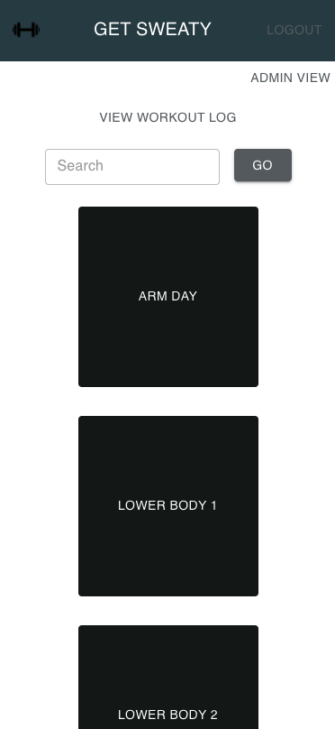
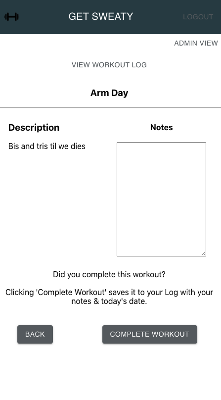
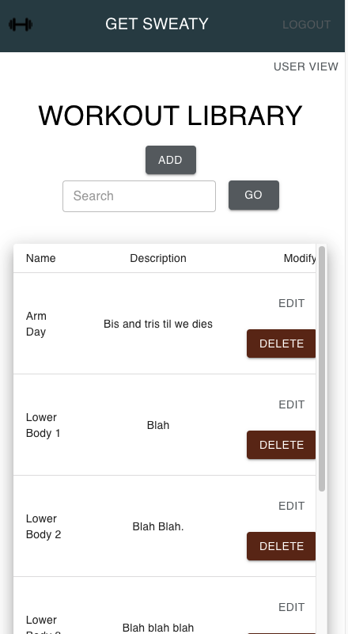
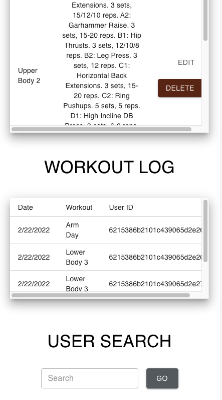
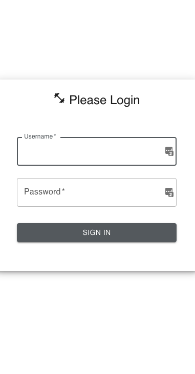

## Shelby Goudy
## CS602_ Group 3
### Due: 28 Feb 22
# Final Project: Get Sweaty

* User View  


* User View of an Individual Workout   


* Admin Main  


* Admin Scrolled Down  


* Login Page  


Getting Started:

This app is connected to my Mongo Cloud account. To run this app locally, you'll need my credentials.  
Once credentials are in place:

```
cd api
npm install 
node initDB.js 
npm start
```


```
cd client
npm install
npm start
```

Login Information:  
### username: user  
### password: user

...to view the customer perspective.

### username: admin
### password: admin

...to get the admin perspective.